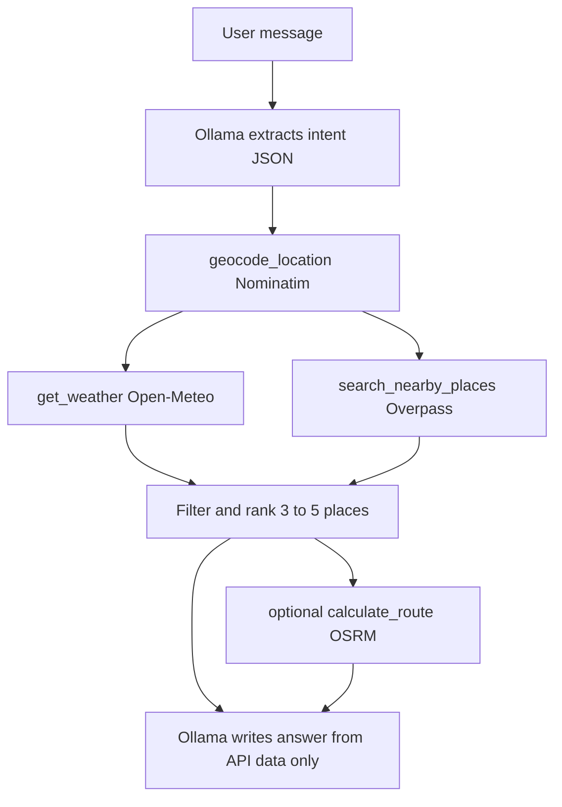

# HanseGuide – Hamburg Local Assistant

Chốt sản phẩm: chatbot agent gợi ý **café**, **thư viện** và **công viên** tại Hamburg. LLM: **Ollama local**. MVP không cần database, login, booking, review hay transit.

**Nơi code:** folder riêng [`hanse_guide/`](hanse_guide/). Copy `backend/` và `frontend/` vào đó, rồi chỉ sửa/thêm code trong copy. **Không đụng** [`backend/`](backend/) và [`frontend/`](frontend/) ở root.

## Cấu trúc repo sau khi copy

```text
hanse_guide/
  backend/          # copy từ backend/
  frontend/         # copy từ frontend/
  README.md         # cách chạy HanseGuide
```

Khi copy, bỏ `venv/`, `node_modules/`, `__pycache__/`, `.env`, `backend/app/frontend/` (build). Backend copy dùng **port 8001**, frontend copy **port 5174**, để không đụng template gốc (8000 / 5173).

Backend gốc bắt buộc Postgres (`DATABASE_URL` trong settings). Sau khi copy, nới settings của bản copy để **boot được không cần DB**: HanseGuide endpoints không auth, không SQLModel. Giữ FastAPI + Pydantic + httpx; có thể để nguyên login/items trong copy nhưng không dùng cho demo.

## Phạm vi MVP

Ba nhóm địa điểm: café, thư viện, công viên.

Câu hỏi mẫu:

> “Chiều nay mình muốn tìm một nơi yên tĩnh gần Hamburg Hbf để học. Nếu trời không mưa thì gợi ý thêm một công viên gần đó.”

Response: `answer`, `intent`, `weather`, 3–5 `places` (tên/địa chỉ/khoảng cách/tọa độ/lý do), `tools_used`. **Địa điểm chỉ từ API.** Ollama không bịa tên chỗ.

## Tech stack

- Backend: FastAPI trong [`hanse_guide/backend`](hanse_guide/backend) (`httpx`, Pydantic)
- Agent: Ollama (`OLLAMA_BASE_URL`, `OLLAMA_MODEL`)
- Frontend: React + Vite trong [`hanse_guide/frontend`](hanse_guide/frontend)
- Bản đồ: Leaflet + OpenStreetMap
- Database: không dùng cho MVP

## Kiến trúc



## Backend functions

Đặt trong `hanse_guide/backend/app/hanseguide/`:

- `geocode_location(location)` — Nominatim, `countrycodes=de`, viewbox Hamburg, `User-Agent` bắt buộc
- `get_weather(latitude, longitude, date=None)` — Open-Meteo
- `search_nearby_places(...)` — Overpass: cafe → `amenity=cafe`, library → `amenity=library`, park → `leisure=park`
- `calculate_route(...)` — haversine trước; OSRM nếu còn thời gian
- `run_agent(message)` — intent → tools → rank → answer

Fallback nếu Ollama tắt: parser từ khóa, mặc định location `Hamburg Hbf`.

## FastAPI endpoints (trong bản copy)

- `POST /api/v1/hanseguide/chat`
- `GET /api/v1/hanseguide/places`
- `GET /api/v1/hanseguide/weather`
- `GET /api/v1/hanseguide/health`

Đăng ký trong `hanse_guide/backend/app/api/main.py`. Không auth. Lỗi API ngoài → 502, không hallucinate địa điểm.

## Frontend (trong bản copy)

Trang public `hanse_guide/frontend/src/routes/hanseguide.tsx`:

- Tiêu đề “What would you like to do in Hamburg?”
- Chat, chip `Find a study place` / `Find a café` / `Plan a walk`
- Thẻ thời tiết, list địa điểm, Leaflet, `Tools used`

Point `VITE_API_URL` (hoặc tương đương) sang `http://localhost:8001`.

## Chia việc

- **Vân Anh:** copy backend, wrappers, agent, tests
- **Quân:** copy frontend, chat UI, cards, map
- **Cả hai:** nối FE–BE, demo

## Thứ tự triển khai

1. Copy `backend/` + `frontend/` → `hanse_guide/`, nới settings để chạy không Postgres, đổi port
2. Wrappers Nominatim / Open-Meteo / Overpass
3. GET places/weather/health trên `http://localhost:8001/docs`
4. POST `/chat` + Ollama + rank
5. Trang React chat + chips + cards
6. Leaflet
7. Ba câu demo + README + pitch

Câu demo:

1. Học yên tĩnh gần Hamburg Hbf chiều nay; thêm công viên nếu không mưa
2. Find a café near Schanze to meet a friend
3. Plan a walk — park near Planten un Blomen

## Pitch (16/9)

> HanseGuide is an AI-powered local assistant for Hamburg. Users can describe what they want to do in natural language, such as finding a quiet place to study or planning an outdoor activity. The agent automatically selects and calls geocoding, places and weather APIs, combines the results and produces a personalized recommendation. The backend is implemented with FastAPI, while the frontend provides a conversational interface and location-based result cards.
