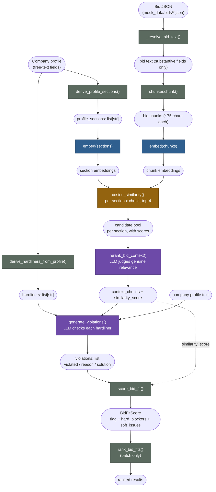

# Bid-Fit ML pipeline — data flow

The actual data flow from a company profile and a bid document, through
embeddings and cosine-similarity filtering, to two separate LLM calls, to a
final score. Laid out stage by stage so each transformation can be checked
before trusting the next one.

> Rendering note: GitHub renders the Mermaid block below natively. In VS
> Code, either install the "Markdown Preview Mermaid Support" extension or
> use a recent VS Code version with built-in Mermaid preview support, then
> open Markdown Preview (`Ctrl+Shift+V`).

## Four kinds of step

Only two of the seven steps below call an LLM. The rest are plain code —
worth knowing, because the deterministic steps should never be wrong twice
and the LLM steps are the ones actually worth spot-checking by hand.

| Type | Meaning |
|---|---|
| 🟩 **rule-based** | plain Python, deterministic, no model |
| 🟦 **embedding model** | text → vector, via Ollama or Gemini |
| 🟧 **cosine math** | deterministic distance calculation on vectors |
| 🟪 **LLM call** | generative, non-deterministic, needs spot-checking |

## The pipeline, stage by stage

Same order the data actually moves in — each stage's **output** is the next
stage's **input**.

### 1. Derive hardliners & profile sections — 🟩 rule-based

- **Input:** the company's `CompanyProfile` row — free-text fields like
  `hardliners`, `exclusions`, `capabilities`, `geographic_reach`, ...
- **Operation:** `derive_hardliners_from_profile()` splits `hardliners` +
  `exclusions` one line each. `derive_profile_sections()` turns every
  free-text field into its own query string.
- **Output:** `hardliners: list[str]` and `profile_sections: list[str]` — no
  LLM involved, so this should exactly mirror what's typed into the profile
  textboxes, one item per line.
- **Check it:** `GET /bid-fit/extract-hardliners` and
  `GET /bid-fit/profile-sections`. If either list looks wrong, the bug is in
  the profile text or the split logic — not downstream.

### 2. Load & chunk the bid — 🟩 rule-based

- **Input:** bid JSON (contract-notice schema from `mock_data/bids/*.json`)
  or raw `bid_content`.
- **Operation:** `_resolve_bid_text()` pulls only substantive fields (title,
  description, place, value, criteria, document text) — falls back to a
  generic flatten for other shapes — then `DefaultChunker` splits it (75
  chars, 10 overlap, sentence-aware breaks).
- **Output:** a list of short text chunks, each well under 75 characters.
- **Check it:** no single endpoint covers this exact combo — the dev-only
  `/tools/rag/load` and `/tools/rag/chunk` exercise loader and chunker
  separately. Look for chunks breaking on real sentence/clause boundaries,
  not mid-word, and confirm boilerplate (notice IDs, CPV codes) got excluded
  rather than flattened in.

### 3. Embed sections and chunks — 🟦 embedding model

- **Input:** `profile_sections` (stage 1) and bid chunks (stage 2) — two
  separate lists of strings.
- **Operation:** `EmbeddingClient.embed()` — Ollama-hosted
  (`qwen3-embedding:0.6b` default, or `bge-m3`/`jina-embeddings-v3` for
  multilingual) or Google's `gemini-embedding-2-preview`.
- **Output:** one vector per section, one vector per chunk — same embedding
  model for both, since cosine distance only means something between
  vectors from the same model.
- **Check it:** no endpoint returns raw vectors. Swap `embedding_model` on
  `/bid-fit/retrieve` or `/analyze` — if `similarity_score` never moves when
  you change models, the embedding call likely isn't actually happening.

### 4. Cosine-similarity candidate pool — 🟧 cosine math

- **Input:** section embeddings × chunk embeddings (stage 3) — every
  section compared against every chunk.
- **Operation:** `_rank_chunks_per_section()` computes `cosine_similarity`
  for every pair, keeps the top 4 chunks per section (the pipeline's
  `DEFAULT_RERANK_CANDIDATE_POOL`), highest first.
- **Output:** per section, up to 4 `(chunk, score)` pairs, score in
  `[0, 1]`.
- **Check it:** `POST /bid-fit/retrieve` — this is the one endpoint with
  *no LLM in between*, so it's the cleanest place to sanity-check
  embeddings + cosine math directly: scores should sit in `[0,1]` and the
  top chunk for an obvious section (e.g. "geographic reach") should
  visibly relate to it. Note it uses a plain 0.55 threshold on the single
  best match rather than this stage's top-4 pool — close enough to
  validate the math, not identical to what stage 5 sees.

### 5. LLM reranks the candidates — 🟪 LLM call

- **Input:** each section's up-to-4 cosine candidates (stage 4).
- **Operation:** `rerank_bid_context()` — LLM structured output
  (`RerankResult`) judges, per section, whether *any* candidate is
  genuinely relevant (not just same-domain vocabulary); if so, copies the
  best one back verbatim.
- **Output:** `context_chunks` (top 5 by default) and
  `similarity_score = matched_sections / total_sections`.
- **Check it — gap:** no endpoint isolates `rerank_bid_context` directly
  today. Run `/bid-fit/retrieve` first to see the candidate pool, then run
  a full `/analyze` and compare its `similarity_score` and implied context
  against those candidates by eye. Worth adding a dedicated endpoint if
  this step ever looks off.

### 6. LLM checks each hardliner — 🟪 LLM call

- **Input:** `hardliners` (stage 1), the company's full profile text,
  `context_chunks` (stage 5).
- **Operation:** `generate_violations()` — LLM structured output
  (`FitAnalysis`) decides, per hardliner: is it actually contradicted (not
  just topically related), and is a realistic fix available given the
  company's own words?
- **Output:** `violations: list[HardlinerViolation]` — each with
  `violated`, `reason`, `solution`, `solution_is_realistic`.
- **Check it:** `POST /bid-fit/generate-violations` — feed it hand-picked
  hardliners and context chunks and read the `reason` field. This is the
  step most worth spot-checking by hand: it's free-text judgment, not a
  deterministic score, and it's where prompt wording actually matters.

### 7. Score, then rank (batch only) — 🟩 rule-based

- **Input:** `violations` (stage 6) + `similarity_score` (stage 5).
- **Operation:** `score_bid_fit()`: any unsolved violation → red; all
  violations solved → yellow; none → green. In batch runs,
  `rank_bid_fits()` then sorts every bid's score, flag first,
  `similarity_score` breaking ties.
- **Output:** `BidFitScore`: `flag`, `similarity_score`, `hard_blockers`,
  `soft_issues`.
- **Check it:** `POST /bid-fit/score` and `POST /bid-fit/rank` — both pure
  functions. Feed a synthetic violations list and confirm the flag follows
  the rule exactly; if this stage is ever wrong, the bug is in the code,
  not the model.

## Worked example (illustrative, not a live run)

One hardliner traced through every stage, with values in the shape each
stage actually produces — company: **Brenner & Sohn Tiefbau GmbH**; bid: a
notice requiring rail-adjacent track work.

| Stage | Value |
|---|---|
| 1 · hardliner | `"No rail-side work"` (from the profile's own `hardliners` field) |
| 1 · section | `"Exclusions: Rail-side work (no DB qualification, no certified safety staff)"` |
| 4 · candidates | `0.71` "Contractor must coordinate with DB Netz for track possession windows during phase 2." `0.68` "Safety briefings for trackside personnel are mandatory before mobilization." `0.52` "General site access is via the B12 service road." `0.40` "Payment terms: 30 days net from invoice." |
| 5 · reranked | matched: `true` → chunk: `"Contractor must coordinate with DB Netz for track possession windows during phase 2."` (the 0.71 candidate — the LLM rejected the 0.68 one as generic safety boilerplate, not specifically about requiring rail work) |
| 6 · violation | `violated: true`, `reason: "Bid requires coordinating DB Netz rail possession windows — this is rail-side work."`, `solution: null`, `solution_is_realistic: false` (no certified safety staff — not fixable by subcontracting a single certification) |
| 7 · score | 🔴 **red** — `hard_blockers: ["No rail-side work"]` |

## Data-flow diagram

Same seven stages, drawn as data in motion. Rounded nodes are data at rest;
rectangles are the operation that transforms it, colored by the four step
types above. Only the two purple rectangles are non-deterministic.

## One caveat

`POST /bid-fit/retrieve` (used to validate stage 4) is a *simpler, separate*
function (`retrieve_bid_context` — a plain 0.55 cosine cutoff) from what the
real pipeline runs at stage 4→5 (`_rank_chunks_per_section` +
`rerank_bid_context`). A good `/retrieve` result confirms the embedding +
cosine math works — it doesn't prove stage 5's LLM rerank is behaving.

## Two ways to run it

- **Single bid** — `POST /bid-fit/analyze` runs all 7 stages against the
  caller's stored profile. `POST /bid-fit/screen` runs the same stages with
  hardliners passed in directly — no stored profile needed.
- **Dashboard batch** — `POST /bid-fit/analyze-bids` runs the 7 stages
  concurrently over every row in the `bids` table, one thread per bid, then
  stage 7's `rank_bid_fits()` orders the results.

---

Source: `backend/app/agents/bid_fit.py`, `backend/app/agents/bid_fit_scoring.py`,
`backend/app/api/routes/bid_fit.py` on branch `agent-generate`.
