# Bid-Fit pipeline — workflow and function map

## Workflow

**Two ways in:**

1. **Single-bid test** — `POST /bid-fit/analyze` (uses the caller's stored
   `CompanyProfile`) or `POST /bid-fit/screen` (hardliners passed in
   directly, no profile needed). Both call into the same LangGraph pipeline.
2. **Dashboard batch run** — `POST /bid-fit/analyze-bids`: pulls every row
   from the `bids` table (seeded via `POST /bids/load` from
   `mock_data/bids/*.json`), runs the same pipeline concurrently (one thread
   per bid, `provider="google"` by default), drops any bid whose analysis
   raised an exception, ranks the survivors, returns the top N. This is what
   the dashboard's "Load data" + "Analyze" buttons drive.

**Inside the pipeline** (`build_bid_fit_graph`, 3 LangGraph nodes):

1. **`load_bid_context`** — resolve the bid's text (schema-aware extraction
   for this app's contract-notice JSON, else generic flatten), chunk it,
   embed each chunk and each company-profile section, take each section's
   top-4 cosine-similarity candidates, then have the **LLM rerank** each
   section's small candidate pool to throw out same-domain-but-irrelevant
   boilerplate (a plain cosine threshold can't tell "genuinely relevant"
   from "same vocabulary"). Output: matched context chunks + a
   `similarity_score`.
2. **`analyze_fit`** — LLM checks each hardliner against the retrieved
   context: is it *actually* contradicted (not just topically related), and
   if so, is there a realistic fix given the company's own profile text?
3. **`score_fit`** — pure function: any violation with no realistic solution
   → **red**; all violations solvable → **yellow**; no violations →
   **green**. `similarity_score` never affects the flag, only breaks ties
   between same-flag bids.

**Important caveat:** `POST /bid-fit/retrieve` exercises a *different*,
simpler retrieval path (`retrieve_bid_context`, a plain cosine-threshold
cutoff) than what the graph actually uses (`rerank_bid_context`, LLM-based).
It exists to test the raw embedding step in isolation, not to represent what
`/analyze` does internally. A good `/retrieve` result does **not** guarantee
the graph's own retrieval behaves the same way — verify with
`/generate-violations` and `/score` on the graph's actual output instead.

## How to use this to debug/verify

The per-stage endpoints each isolate exactly one function in the diagram
below:

- `GET /bid-fit/extract-hardliners`
- `GET /bid-fit/profile-sections`
- `POST /bid-fit/retrieve` (note the caveat above)
- `POST /bid-fit/generate-violations`
- `POST /bid-fit/score`
- `POST /bid-fit/rank`

If `/analyze` gives a surprising result, run these individually, in order,
with the same inputs. That tells you whether the problem is:

- **Retrieval** — wrong/no chunks matched a section.
- **LLM judgment** — violations wrong given otherwise-correct context.
- **Scoring** — flag wrong given otherwise-correct violations.

## Diagram

```mermaid
flowchart TD
    subgraph Frontend
        UI_Load["BidsAnalysisPanel: Load data button"]
        UI_Analyze["BidsAnalysisPanel: Analyze button"]
        UI_Card["BidMatchCard (renders results)"]
    end

    subgraph Seeding
        R_BidsLoad["POST /bids/load"]
        F_LoadMock["load_mock_bids()"]
        MockBids["mock_data/bids/*.json"]
        Tbl_Bids[("bids table")]
    end

    subgraph EntryPoints["Bid-Fit API entry points"]
        R_Analyze["POST /bid-fit/analyze\n(analyze_bid_fit)"]
        R_Screen["POST /bid-fit/screen\n(screen_bid)"]
        R_AnalyzeBids["POST /bid-fit/analyze-bids\n(analyze_bids)"]
        R_ExtractHL["GET /bid-fit/extract-hardliners"]
        R_ProfileSections["GET /bid-fit/profile-sections"]
        R_Retrieve["POST /bid-fit/retrieve"]
        R_GenViol["POST /bid-fit/generate-violations"]
        R_Score["POST /bid-fit/score"]
        R_Rank["POST /bid-fit/rank"]
    end

    subgraph ProfileSetup["Hardliner / section derivation (no LLM)"]
        GetProfile["_get_company_profile()"]
        F_DeriveHL["derive_hardliners_from_profile()"]
        F_DeriveSections["derive_profile_sections()"]
        F_FormatProfile["format_company_profile()"]
    end

    subgraph Graph["build_bid_fit_graph (LangGraph)"]
        N_Load["Node: load_bid_context"]
        N_Analyze["Node: analyze_fit"]
        N_Score["Node: score_fit"]
    end

    subgraph LoadContextInternals["load_bid_context internals"]
        F_LoadChunk["_load_and_chunk_bid()"]
        F_ResolveText["_resolve_bid_text()"]
        F_ExtractNotice["_extract_bid_notice_text()"]
        F_Flatten["flatten_json_to_text()"]
        F_Chunker["get_chunker().chunk()"]
        F_RankPerSection["_rank_chunks_per_section()\n(embed + cosine_similarity)"]
        F_Rerank["rerank_bid_context()\nLLM structured output: RerankResult"]
    end

    subgraph IsolatedRetrieve["Standalone retrieval path (/retrieve only)"]
        F_RetrieveCtx["retrieve_bid_context()\n(cosine match_threshold cutoff)"]
    end

    subgraph ViolationScoring
        F_GenViol["generate_violations()\nLLM structured output: FitAnalysis"]
        F_ScoreFit["score_bid_fit()"]
        F_RankFits["rank_bid_fits()"]
    end

    %% Seeding flow
    UI_Load --> R_BidsLoad --> F_LoadMock --> MockBids
    F_LoadMock --> Tbl_Bids

    %% analyze-bids flow
    UI_Analyze --> R_AnalyzeBids
    R_AnalyzeBids --> GetProfile
    R_AnalyzeBids --> Tbl_Bids
    R_AnalyzeBids -->|"per bid, concurrently"| RunAnalysis["run_bid_fit_analysis()"]
    R_AnalyzeBids --> F_RankFits
    F_RankFits --> UI_Card

    %% single analyze flow
    R_Analyze --> GetProfile --> RunAnalysis

    %% screen flow (no profile)
    R_Screen --> RunScreen["run_bid_screen()"]

    %% run_bid_fit_analysis internals
    RunAnalysis --> F_FormatProfile
    RunAnalysis --> F_DeriveSections
    RunAnalysis --> F_DeriveHL
    RunAnalysis --> Graph

    %% run_bid_screen internals (hardliners given directly)
    RunScreen --> Graph

    %% Graph wiring
    N_Load --> N_Analyze --> N_Score

    N_Load --> F_LoadChunk --> F_ResolveText
    F_ResolveText --> F_ExtractNotice
    F_ResolveText --> F_Flatten
    F_LoadChunk --> F_Chunker
    N_Load --> F_RankPerSection --> F_Rerank

    N_Analyze --> F_GenViol
    N_Score --> F_ScoreFit

    %% Per-stage isolated endpoints (test individual functions directly)
    R_ExtractHL --> GetProfile
    R_ExtractHL --> F_DeriveHL
    R_ProfileSections --> GetProfile
    R_ProfileSections --> F_DeriveSections
    R_Retrieve --> F_RetrieveCtx
    R_GenViol --> F_GenViol
    R_Score --> F_ScoreFit
    R_Rank --> F_RankFits
```

